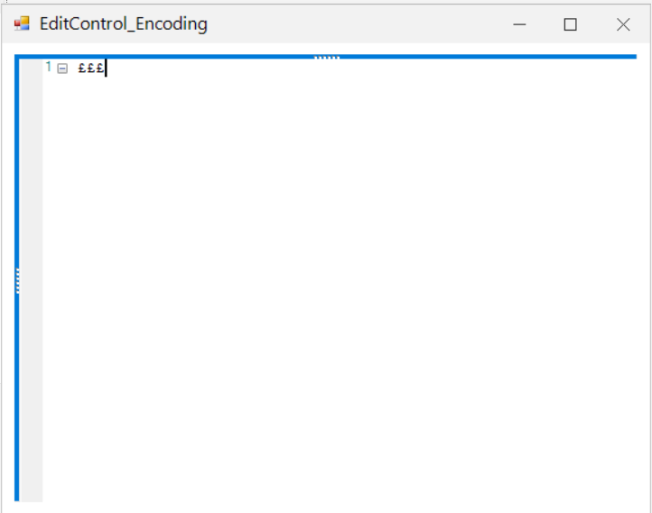

# How-to-avoid-argument-exception-while-appending-the-Euro-symbol-to-EditControl
This repository contains the sample that how to to avoid argument exception while appending the Euro € symbol  to EditControl.

The SetEncoding method should be set to default type for encoding  to load /assign the text value with equation or symbols. The symbols can be assigned to Text property when typing the text directly  without loading in EditControl  and setting the encoding as shown in the following code.

```C#
// Set encoding 
this.editControl2.SetEncoding(Encoding.Default);
this.editControl2.Text = "£££";
```

```VB
Me.editControl2.SetEncoding(Encoding.Default)
Me.editControl2.Text = "£££"
```

When assigning the text using StreamReader the encoding can be set as like below

```C#
string inputPath = @"../../TextFile1.txt";
string outputPath = @"../../TextFile2.txt";


var fs = new FileStream(inputPath, FileMode.Open, FileAccess.Read,
FileShare.ReadWrite | FileShare.Delete);
string content;
using (StreamReader reader = new StreamReader(fs, Encoding.Default))
{
content = reader.ReadToEnd();
}

File.WriteAllText(outputPath, content, Encoding.Default);
this.editControl2.Text = content;
```
```VB
Dim inputPath As String = "../../TextFile1.txt"
Dim outputPath As String = "../../TextFile2.txt"

Dim fs = New FileStream(inputPath, FileMode.Open, FileAccess.Read, FileShare.ReadWrite Or FileShare.Delete)
Dim content As String
Using reader As New StreamReader(fs, Encoding.Default)
content = reader.ReadToEnd()
End Using

File.WriteAllText(outputPath, content, Encoding.Default)
Me.editControl2.Text = content
```


Output:


